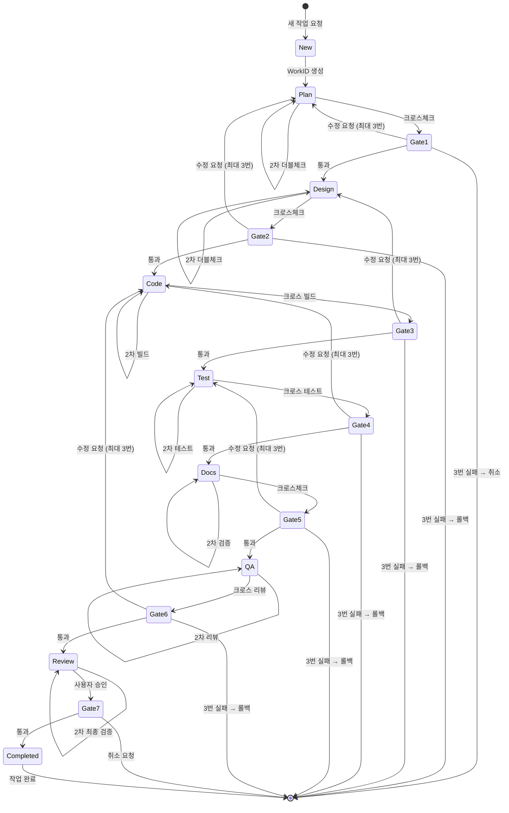

# 자동 업데이트 시스템

> WorkID 기반 작업 추적 및 자동 업데이트 시스템입니다.

---

## 원칙

**에이전트는 모든 작업 단계에서 자동으로 WORK_IN_PROGRESS.md를 업데이트합니다.**

사용자가 별도 업데이트 지시할 필요가 없습니다!

---

## 📋 WIP 관리 핵심 구조

### 단일 진실 공급원 (Single Source of Truth)
- **WORK_IN_PROGRESS.md**: 모든 작업의 중심 저장소
- **WorkID 기반 추적**: 각 작업은 고유한 WorkID로 식별
- **에이전트 간 간접 통신**: 직접 통신 없이 WORK_IN_PROGRESS.md를 통한 상태 공유

### WORK_IN_PROGRESS.md 구조
```markdown
# 작업 추적 및 재개 시스템

## 📊 현재 작업 목록
### 활성 작업 (진행 중)
### 완료 작업 (히스토리)
### 취소된 작업 (취소 히스토리)

## 📝 작업 상세
### WIP-YYYYMMDD-NNN: [작업 제목]
#### 📋 계획 요약
#### ✅ 완료 단계
#### 🚪 Validation Gates
#### 🚧 진행 상황
#### 🔗 관련 파일
#### 💬 사용자 메모

## 🎯 WorkID 형식
## 🚨 긴급 명령어
## 📝 작업 완료/취소 시 처리
## 🔍 상태 확인 명령어
## 📊 보고서 생성
## 🎯 에이전트 동작 가이드
## 🔄 WorkID 충돌 방지 시스템
## 📊 상태 전이 다이어그램
```

---

## 🔄 WorkID 충돌 방지 시스템

### 충돌 가능 상황
- 병렬 작업: 2개 이상의 에이전트가 동시에 WorkID 생성 시도
- 단일 진실 공급원: WORK_IN_PROGRESS.md가 모든 작업의 중심이므로, 충돌은 드뭅니다

### 충돌 방지 전략

#### 1. 쓰기 전 읽기 (Read-Before-Write)
```markdown
## WorkID 생성 로직

1. WORK_IN_PROGRESS.md 전체 읽기
2. 마지막 WorkID 확인
3. 새 WorkID 생성
4. WORK_IN_PROGRESS.md 다시 읽기 (중간에 다른 에이전트가 썼는지 확인)
5. 마지막 WorkID가 변경되었으면 2부터 다시 시작
6. 변경되지 않았으면 쓰기
```

#### 2. 재시도 로직
```markdown
## WorkID 생성 함수

def create_workid():
    """
    새로운 WorkID를 생성합니다.
    충돌 방지를 위해 최대 3번 재시도합니다.
    """
    for attempt in range(1, 4):
        # 1. WORK_IN_PROGRESS.md 읽기
        content = read_file("WORK_IN_PROGRESS.md")
        last_workid = find_last_workid(content)

        # 2. 새 WorkID 생성
        new_workid = generate_new_workid(last_workid)

        # 3. WORK_IN_PROGRESS.md 다시 읽기 (중간 확인)
        content_check = read_file("WORK_IN_PROGRESS.md")
        last_workid_check = find_last_workid(content_check)

        # 4. 충돌 확인
        if last_workid == last_workid_check:
            # 충돌 없음: 쓰기
            write_to_file("WORK_IN_PROGRESS.md", new_workid)
            return new_workid
        else:
            # 충돌: 재시도
            print(f"충돌 발견! {attempt}차 시도 재시도 중...")
            continue

    # 3번 시도 후 실패
    raise Exception("WorkID 생성 실패: 3번 시도 후 충돌 발생")
```

#### 3. 에이전트 구현 예시
```markdown
## WorkID 생성 예시

### 시나리오: 1차 시도 성공
1차 시도:
  - WORK_IN_PROGRESS.md 읽기
  - 마지막 WorkID: WIP-20250205-001
  - 새 WorkID: WIP-20250205-002 생성 시도
  - WORK_IN_PROGRESS.md 다시 읽기
  - 마지막 WorkID: WIP-20250205-001 (변경 없음)
  - 성공: WIP-20250205-002 생성 ✅

### 시나리오: 충돌 발생 및 해결
1차 시도:
  - WORK_IN_PROGRESS.md 읽기
  - 마지막 WorkID: WIP-20250205-001
  - 새 WorkID: WIP-20250205-002 생성 시도
  - WORK_IN_PROGRESS.md 다시 읽기
  - 마지막 WorkID: WIP-20250205-002 (다른 에이전트가 생성)
  - 충돌 발견 → 2차 시도

2차 시도:
  - WORK_IN_PROGRESS.md 다시 읽기
  - 마지막 WorkID: WIP-20250205-002
  - 새 WorkID: WIP-20250205-003 생성 시도
  - WORK_IN_PROGRESS.md 다시 읽기
  - 마지막 WorkID: WIP-20250205-002 (변경 없음)
  - 성공: WIP-20250205-003 생성 ✅

### 시나리오: 3번 시도 후 성공
1차 시도: 충돌 → 2차 시도
2차 시도: 충돌 → 3차 시도
3차 시도:
  - WORK_IN_PROGRESS.md 읽기
  - 마지막 WorkID: WIP-20250205-003
  - 새 WorkID: WIP-20250205-004 생성 시도
  - WORK_IN_PROGRESS.md 다시 읽기
  - 마지막 WorkID: WIP-20250205-003 (변경 없음)
  - 성공: WIP-20250205-004 생성 ✅
```

#### 4. 충돌 발생 시 처리
```markdown
## 수동 요청 (3번 시도 후 실패)

에이전트:
⚠️ WorkID 생성 실패: 3번 시도 후 충돌 발생

[상황]
- 시도한 WorkID: WIP-20250205-003
- 마지막 WorkID: WIP-20250205-003 (다른 에이전트가 생성)

[요청]
사용자가 직접 WorkID를 지정하거나, 나중에 다시 시도해주세요.

[옵션]
1. 사용자: "WorkID는 WIP-20250205-004로 지정해줘"
2. 사용자: "나중에 다시 시도해줘"
```

---

## 📊 상태 전이 다이어그램

### 전체 상태 전이

> **참고**: 아래 다이어그램은 full 프리셋(7단계: Plan → Design → Code → Test → Docs → QA → Review) 기준입니다. lite/standard 프리셋에서는 해당 프리셋의 단계만 포함됩니다.



### 에이전트 간 상태 공유 프로토콜

```markdown
## 에이전트 간 통신 프로토콜

### 통신 규칙
1. **각 에이전트의 첫 번째 동작**: WORK_IN_PROGRESS.md 읽기
2. **각 에이전트의 마지막 동작**: WORK_IN_PROGRESS.md 업데이트
3. **다음 에이전트에게 명시적인 전달 불필요**: WORK_IN_PROGRESS.md가 자동으로 상태 전달
4. **에러 발생 시**: WORK_IN_PROGRESS.md에 에러 기록 및 진행 상황 업데이트

### 데이터 공유 방식

| 데이터 | 저장 위치 | 읽기 권한 | 쓰기 권한 |
|--------|-----------|-----------|-----------|
| WorkID | WORK_IN_PROGRESS.md | 모든 에이전트 | coordinator, doc-manager |
| 현재 단계 | WORK_IN_PROGRESS.md | 모든 에이전트 | 해당 에이전트 |
| 진행 상황 | WORK_IN_PROGRESS.md | 모든 에이전트 | 해당 에이전트 |
| 에러 메시지 | WORK_IN_PROGRESS.md | 모든 에이전트 | 해당 에이전트 |
| 파일 목록 | WORK_IN_PROGRESS.md | 모든 에이전트 | developer, analyst |

### 통신 흐름 예시

#### 정상 흐름 (Gate 통과)
```
analyst
  ↓ (WORK_IN_PROGRESS.md 업데이트: WorkID 생성)
  ↓
architect (WORK_IN_PROGRESS.md 읽기)
  ↓ (WORK_IN_PROGRESS.md 업데이트: Design 단계 완료)
  ↓
developer (WORK_IN_PROGRESS.md 읽기)
  ↓ (WORK_IN_PROGRESS.md 업데이트: Code 단계 완료)
  ↓
tester (WORK_IN_PROGRESS.md 읽기)
  ↓ (WORK_IN_PROGRESS.md 업데이트: Test 단계 완료)
  ↓
doc-manager (WORK_IN_PROGRESS.md 읽기)
  ↓ (WORK_IN_PROGRESS.md 업데이트: Docs 단계 완료)
  ↓
reviewer (WORK_IN_PROGRESS.md 읽기)
  ↓ (WORK_IN_PROGRESS.md 업데이트: QA 단계 완료)
  ↓
coordinator (WORK_IN_PROGRESS.md 읽기)
  ↓ (WORK_IN_PROGRESS.md 업데이트: Review 단계 완료)
```

#### 오류 흐름 (Gate 실패)
```
developer: Code 단계 진행 중...
  ↓ (WORK_IN_PROGRESS.md 업데이트: 빌드 에러)
  ↓
reviewer (WORK_IN_PROGRESS.md 읽기: 빌드 에러 확인)
  ↓ (WORK_IN_PROGRESS.md 업데이트: 수정 요청)
  ↓
developer (WORK_IN_PROGRESS.md 읽기: 수정 요청 확인)
  ↓ (WORK_IN_PROGRESS.md 업데이트: 수정 완료)
  ↓
reviewer (WORK_IN_PROGRESS.md 읽기: 재검증)
  ↓ (WORK_IN_PROGRESS.md 업데이트: 통과)
```
```

---

## 업데이트 규칙

### 1. 작업 시작 시
```
사용자: "신규: CSV 데이터 추출"
```

에이전트 자동 작업:

**Step 1: WorkID 생성**
```markdown
1. 오늘 날짜 확인: 2025-02-05 → 20250205
2. WORK_IN_PROGRESS.md에서 WIP-20250205-* 패턴 검색
3. 가장 높은 NN 찾기 (예: WIP-20250205-002 → 002)
4. 새로운 WorkID 생성: WIP-20250205-003
5. (검색 결과 없으면) WIP-20250205-001 생성
```

**WorkID 생성 예시:**

| WORK_IN_PROGRESS.md 내용 | 마지막 WorkID | 새 WorkID |
|--------------------------|---------------|-----------|
| 없음 | 없음 | WIP-20250205-001 |
| WIP-20250204-001 | 2025-02-04 | WIP-20250205-001 |
| WIP-20250205-001 | WIP-20250205-001 | WIP-20250205-002 |
| WIP-20250205-009 | WIP-20250205-009 | WIP-20250205-010 |

**WorkID 생성 구현 로직 (마크다운):**
```markdown
## WorkID 생성 로직

1. 오늘 날짜 구하기: `YYYYMMDD`
2. WORK_IN_PROGRESS.md에서 `WIP-YYYYMMDD-NNN` 패턴 검색
3. 같은 날짜의 WorkID가 있으면 가장 높은 NN에 +1
4. 같은 날짜의 WorkID가 없으면 001부터 시작
5. 형식: `WIP-YYYYMMDD-NNN` (3자리 숫자, 0 패딩)
```

**Step 2: WORK_IN_PROGRESS.md "활성 작업"에 자동 추가**
```markdown
1. "### 활성 작업 (진행 중)" 섹션 찾기
2. 테이블에 새 행 추가:
   | WIP-20250205-001 | ⏸️ 진행 중 | 신규 | CSV 데이터 추출 | 2025-02-05 | 0% |
3. (테이블이 없으면) 새로 생성
```

**Step 3: 해당 WorkID 상세 섹션 자동 생성**
```markdown
1. "## 📝 작업 상세" 섹션 끝에 추가
2. 새 섹션 생성:
    ### WIP-20250205-001: CSV 데이터 추출

    #### 📋 계획 요약
    - **유형**: 신규
    - **시작일**: 2025-02-05

    #### ✅ 완료 단계
    - [ ] 1. Plan (계획): 기획서 분석, 유형 판단, 계획 수립
    - [ ] 2. Design (설계): 아키텍처 설계, 기술적 검증
    - [ ] 3. Code (코딩): 코드 구현, 빌드 확인
    - [ ] 4. Test (테스트): 단위 테스트 자동 생성, 기능 테스트, 빌드 테스트
    - [ ] 5. Docs (문서화): 각 단계별 문서 업데이트, API 문서 생성
    - [ ] 6. QA (품질검사): 코드 품질, 스타일, 아키텍처 준수 검토
    - [ ] 7. Review (최종검토): 전체 결과물 종합 검토, 최종 승인

    #### 🔗 관련 파일
    - (아직 없음)

    #### 💬 사용자 메모
    - (아직 없음)
```

에이전트 자동 작업:
```markdown
1. WorkID 생성: WIP-20250202-001
2. WORK_IN_PROGRESS.md "활성 작업"에 자동 추가
3. 해당 WorkID 상세 섹션 자동 생성
```

WORK_IN_PROGRESS.md 업데이트 (자동):
```markdown
### 활성 작업 (진행 중)
| WorkID | 상태 | 유형 | 제목 | 시작일 | 진척도 |
|--------|------|------|------|--------|--------|
| WIP-20250202-001 | ⏸️ 진행 중 | 신규 | CSV 데이터 추출 | 2025-02-02 | 0% |

### WIP-20250202-001: CSV 데이터 추출

#### 📋 계획 요약
- **유형**: 신규
- **시작일**: 2025-02-02

#### ✅ 완료 단계
- [ ] 기획서 분석
- [ ] 계획 수립
- [ ] 사용자 확인
```

---

### 2. 각 단계 완료 시

**1단계 완료 (Plan):**
```markdown
- [x] 1. Plan (계획): 기획서 분석, 유형 판단, 계획 수립
```

**2단계 완료 (Design):**
```markdown
- [x] 1. Plan (계획): 기획서 분석, 유형 판단, 계획 수립
- [x] 2. Design (설계): 아키텍처 설계, 기술적 검증
```

**3단계 완료 (Code):**
```markdown
- [x] 1. Plan (계획): 기획서 분석, 유형 판단, 계획 수립
- [x] 2. Design (설계): 아키텍처 설계, 기술적 검증
- [x] 3. Code (코딩): 코드 구현, 빌드 확인
```

**4단계 완료 (Test):**
```markdown
- [x] 1. Plan (계획): 기획서 분석, 유형 판단, 계획 수립
- [x] 2. Design (설계): 아키텍처 설계, 기술적 검증
- [x] 3. Code (코딩): 코드 구현, 빌드 확인
- [x] 4. Test (테스트): 단위 테스트 자동 생성, 기능 테스트, 빌드 테스트
```

**5단계 완료 (Docs):**
```markdown
- [x] 1. Plan (계획): 기획서 분석, 유형 판단, 계획 수립
- [x] 2. Design (설계): 아키텍처 설계, 기술적 검증
- [x] 3. Code (코딩): 코드 구현, 빌드 확인
- [x] 4. Test (테스트): 단위 테스트 자동 생성, 기능 테스트, 빌드 테스트
- [x] 5. Docs (문서화): 각 단계별 문서 업데이트, API 문서 생성
```

**6단계 완료 (QA):**
```markdown
- [x] 1. Plan (계획): 기획서 분석, 유형 판단, 계획 수립
- [x] 2. Design (설계): 아키텍처 설계, 기술적 검증
- [x] 3. Code (코딩): 코드 구현, 빌드 확인
- [x] 4. Test (테스트): 단위 테스트 자동 생성, 기능 테스트, 빌드 테스트
- [x] 5. Docs (문서화): 각 단계별 문서 업데이트, API 문서 생성
- [x] 6. QA (품질검사): 코드 품질, 스타일, 아키텍처 준수 검토
```

**최종 단계 완료 (Review):**
```markdown
- [x] 1. Plan (계획): 기획서 분석, 유형 판단, 계획 수립
- [x] 2. Design (설계): 아키텍처 설계, 기술적 검증
- [x] 3. Code (코딩): 코드 구현, 빌드 확인
- [x] 4. Test (테스트): 단위 테스트 자동 생성, 기능 테스트, 빌드 테스트
- [x] 5. Docs (문서화): 각 단계별 문서 업데이트, API 문서 생성
- [x] 6. QA (품질검사): 코드 품질, 스타일, 아키텍처 준수 검토
- [x] 7. Review (최종검토): 전체 결과물 종합 검토, 최종 승인
```

---

### 3. 구현 진행 중 (실시간)

**파일 생성 완료:**
```markdown
#### 🚧 진행 상황
2025-02-02 10:15: CSVProcessor.cs 생성 완료
2025-02-02 10:30: CSVExecutionViewModel.cs 생성 완료
```

**각 파일 수정 완료:**
```markdown
#### 🚧 진행 상황
2025-02-02 11:00: CSVProcessor.cs 구현 완료 (150줄)
2025-02-02 11:30: CSVExecutionViewModel.cs 구현 완료 (80줄)
```

---

### 4. 작업 완료 시

사용자: "완료: WIP-20250202-001"

에이전트 자동 작업:
```markdown
1. 완료 단계 모두 체크
2. WORK_IN_PROGRESS.md "완료 작업"으로 자동 이동
3. "활성 작업"에서 자동 제거
4. WORK_HISTORY.json에 자동 추가
```

WORK_IN_PROGRESS.md 업데이트 (자동):
```markdown
### 활성 작업 (진행 중)
*(WIP-20250202-001 제거됨)*

### 완료 작업 (히스토리)
| WorkID | 완료일 | 유형 | 제목 | 소요시간 |
|--------|--------|------|------|----------|
| WIP-20250202-001 | 2025-02-02 | 신규 | CSV 데이터 추출 | 6.5h |

### 완료된 작업 상세

#### WIP-20250202-001: CSV 데이터 추출

**완료일:** 2025-02-02 16:30
**소요 시간:** 6.5시간
**커밋:** abc123

[전체 내용 보존...]
```

---

### 5. 작업 취소 시

사용자: "취소: WIP-20250202-001 우선순위 조정으로 인해"

에이전트 자동 작업:
```markdown
1. WORK_IN_PROGRESS.md "취소 작업"으로 자동 이동
2. "활성 작업"에서 자동 제거
3. 취소 사유 기록
```

WORK_IN_PROGRESS.md 업데이트 (자동):
```markdown
### 활성 작업 (진행 중)
*(WIP-20250202-001 제거됨)*

### 취소된 작업 (취소 히스토리)
| WorkID | 취소일 | 유형 | 제목 | 사유 |
|--------|--------|------|------|------|
| WIP-20250202-001 | 2025-02-02 15:00 | 신규 | CSV 데이터 추출 | 우선순위 조정 |
```

---

## 에이전트 간 통신 프로토콜

### 단일 진실 공급원(Single Source of Truth)

**WORK_IN_PROGRESS.md가 모든 에이전트의 단일 진실 공급원입니다.**

- 모든 에이전트는 WORK_IN_PROGRESS.md를 읽고 씀
- WorkID 기반으로 작업 추적
- 에이전트 간 직접 통신 없이 WORK_IN_PROGRESS.md를 통한 간접 통신

### 통신 흐름

```
coordinator
  ↓ (WORK_IN_PROGRESS.md 업데이트: WorkID 생성)
  ↓
analyst (WORK_IN_PROGRESS.md 읽기)
  ↓ (WORK_IN_PROGRESS.md 업데이트: Plan 단계 완료)
  ↓
architect (WORK_IN_PROGRESS.md 읽기)
  ↓ (WORK_IN_PROGRESS.md 업데이트: Design 단계 완료)
  ↓
developer (WORK_IN_PROGRESS.md 읽기)
  ↓ (WORK_IN_PROGRESS.md 업데이트: Code 단계 완료)
  ↓
tester (WORK_IN_PROGRESS.md 읽기)
  ↓ (WORK_IN_PROGRESS.md 업데이트: Test 단계 완료)
  ↓
doc-manager (WORK_IN_PROGRESS.md 읽기)
  ↓ (WORK_IN_PROGRESS.md 업데이트: Docs 단계 완료)
  ↓
reviewer (WORK_IN_PROGRESS.md 읽기)
  ↓ (WORK_IN_PROGRESS.md 업데이트: QA 단계 완료)
  ↓
coordinator (WORK_IN_PROGRESS.md 읽기)
  ↓ (WORK_IN_PROGRESS.md 업데이트: Review 단계 완료)
```

### 에이전트 통신 규칙

1. **각 에이전트의 첫 번째 동작**: WORK_IN_PROGRESS.md 읽기
2. **각 에이전트의 마지막 동작**: WORK_IN_PROGRESS.md 업데이트
3. **다음 에이전트에게 명시적인 전달 불필요**: WORK_IN_PROGRESS.md가 자동으로 상태 전달
4. **에러 발생 시**: WORK_IN_PROGRESS.md에 에러 기록 및 진행 상황 업데이트

### 데이터 공유 방식

| 데이터 | 저장 위치 | 읽기 권한 | 쓰기 권한 |
|--------|-----------|-----------|-----------|
| WorkID | WORK_IN_PROGRESS.md | 모든 에이전트 | coordinator, doc-manager |
| 현재 단계 | WORK_IN_PROGRESS.md | 모든 에이전트 | 해당 에이전트 |
| 진행 상황 | WORK_IN_PROGRESS.md | 모든 에이전트 | 해당 에이전트 |
| 에러 메시지 | WORK_IN_PROGRESS.md | 모든 에이전트 | 해당 에이전트 |
| 파일 목록 | WORK_IN_PROGRESS.md | 모든 에이전트 | developer, analyst |

---

## 전체 프로세스 요약

```
사용자 지시: "신규: CSV 데이터 추출"
     ↓
에이전트: WorkID 생성 → WORK_IN_PROGRESS.md 추가
     ↓
[자동] 기획서 분석 완료 → 체크박스 체크
     ↓
[자동] 계획 수립 완료 → 체크박스 체크
     ↓
사용자: "y" (확인)
     ↓
[자동] 사용자 확인 완료 → 체크박스 체크
     ↓
[자동] 아키텍처 설계 완료 → 체크박스 체크
     ↓
[자동] 기술적 검증 완료 → 체크박스 체크
     ↓
[자동] 파일 생성 → 진행 상황 타임스탬프
     ↓
[자동] 구현 완료 → 진행 상황 타임스탬프
     ↓
[자동] 빌드/테스트 완료 → 체크박스 체크
     ↓
사용자: "완료: WIP-20250202-001"
     ↓
[자동] 완료 작업으로 이동 → 완료 정보 기록
     ↓
[자동] WORK_HISTORY.json 업데이트
```

---

## 에이전트 체크리스트

### 작업 시작 시
- [x] WorkID 자동 생성
- [x] WORK_IN_PROGRESS.md "활성 작업"에 추가
- [x] 상세 섹션 자동 생성

### 단계 완료 시 (각 단계)
- [x] 완료 단계 체크박스 자동 체크
- [x] 진행 상황 타임스탬프 기록
- [ ] 사용자에게 진행 상황 보고 (선택 사항)

### 작업 완료 시
- [x] 모든 완료 단계 체크
- [x] 완료 작업으로 자동 이동
- [x] 활성 작업에서 자동 제거
- [x] WORK_HISTORY.json 자동 추가

### 작업 취소 시
- [x] 취소 작업으로 자동 이동
- [x] 활성 작업에서 자동 제거
- [x] 취소 사유 기록

---

## 📚 관련 모듈

- [PIPELINE.md](PIPELINE.md) - 개발 파이프라인
- [GATES.md](GATES.md) - Gate 검증 시스템
- [ERROR_HANDLING.md](ERROR_HANDLING.md) - 에러 처리 및 롤백 프로토콜
- [REPORTS.md](REPORTS.md) - 작업 완료 보고서 생성
