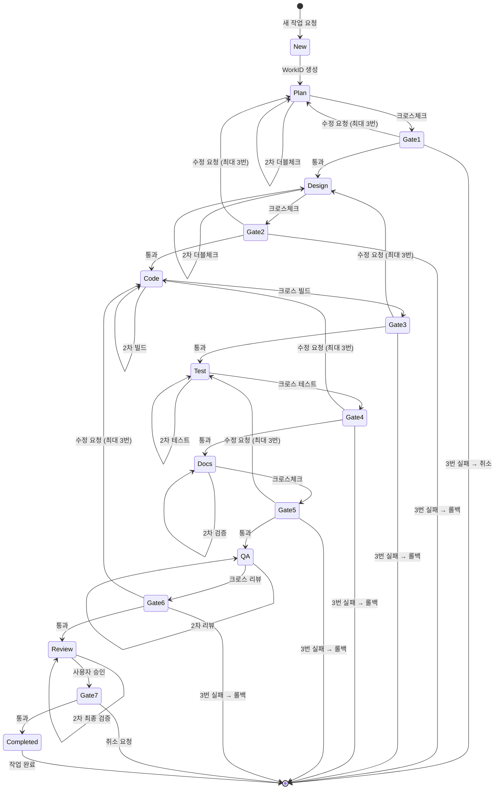

# 자동 업데이트 시스템

> WorkID 기반 작업 추적 및 자동 업데이트 시스템입니다.

---

## 원칙

**에이전트는 모든 작업 단계에서 자동으로 WORK_IN_PROGRESS.md를 업데이트합니다.**

사용자가 별도 업데이트 지시할 필요가 없습니다!

---

## WIP 관리 핵심 구조

### 단일 진실 공급원 (Single Source of Truth)
- **WORK_IN_PROGRESS.md**: 모든 작업의 중심 저장소
- **WorkID 기반 추적**: 각 작업은 고유한 WorkID로 식별
- **에이전트 간 간접 통신**: 직접 통신 없이 WORK_IN_PROGRESS.md를 통한 상태 공유

### WORK_IN_PROGRESS.md 구조
```markdown
# 작업 진행 현황

## 활성 작업
(진행 중인 작업 테이블)

## 작업 상세
### WIP-YYYYMMDD-NNN: [작업 제목]
#### 계획 요약
#### 완료 단계
#### Validation Gates
#### 진행 상황
#### 관련 파일
#### 사용자 메모
```

### WORK_HISTORY.md 구조
```markdown
# 작업 히스토리

## 완료 작업
(완료된 작업 테이블)

## 취소된 작업
(취소된 작업 테이블)
```

---

## WorkID 충돌 방지 시스템

### 충돌 방지 전략: 쓰기 전 읽기 (Read-Before-Write)
```
1. WORK_IN_PROGRESS.md 전체 읽기
2. 마지막 WorkID 확인
3. 새 WorkID 생성
4. WORK_IN_PROGRESS.md 다시 읽기 (중간에 다른 에이전트가 썼는지 확인)
5. 마지막 WorkID가 변경되었으면 2부터 다시 시작
6. 변경되지 않았으면 쓰기
```

- **최대 3번 재시도**, 3번 실패 시 사용자에게 WorkID 수동 지정 요청
- 병렬 작업 시에도 WORK_IN_PROGRESS.md가 단일 진실 공급원이므로 충돌은 드뭅니다

---

## 상태 전이 다이어그램

> **참고**: 아래 다이어그램은 full 프리셋(7단계: Plan → Design → Code → Test → Docs → QA → Review) 기준입니다. lite/standard 프리셋에서는 해당 프리셋의 단계만 포함됩니다.


```mermaid
stateDiagram-v2
    [*] --> New: 새 작업 요청
    New --> Plan: WorkID 생성

    Plan --> Plan: 1차 더블체크
    Plan --> Plan: 2차 더블체크
    Plan --> Gate1: 크로스체크
    Gate1 --> Design: 통과
    Gate1 --> Plan: 수정 요청 (최대 3번)
    Gate1 --> [*]: 3번 실패 → 취소

    Design --> Design: 1차 더블체크
    Design --> Design: 2차 더블체크
    Design --> Gate2: 크로스체크
    Gate2 --> Code: 통과
    Gate2 --> Plan: 수정 요청 (최대 3번)
    Gate2 --> [*]: 3번 실패 → 롤백

    Code --> Code: 1차 빌드
    Code --> Code: 2차 빌드
    Code --> Gate3: 크로스 빌드
    Gate3 --> Test: 통과
    Gate3 --> Design: 수정 요청 (최대 3번)
    Gate3 --> [*]: 3번 실패 → 롤백

    Test --> Test: 1차 테스트
    Test --> Test: 2차 테스트
    Test --> Gate4: 크로스 테스트
    Gate4 --> Docs: 통과
    Gate4 --> Code: 수정 요청 (최대 3번)
    Gate4 --> [*]: 3번 실패 → 롤백

    Docs --> Docs: 1차 검증
    Docs --> Docs: 2차 검증
    Docs --> Gate5: 크로스체크
    Gate5 --> QA: 통과
    Gate5 --> Test: 수정 요청 (최대 3번)
    Gate5 --> [*]: 3번 실패 → 롤백

    QA --> QA: 1차 리뷰
    QA --> QA: 2차 리뷰
    QA --> Gate6: 크로스 리뷰
    Gate6 --> Review: 통과
    Gate6 --> Code: 수정 요청 (최대 3번)
    Gate6 --> [*]: 3번 실패 → 롤백

    Review --> Review: 1차 최종 검증
    Review --> Review: 2차 최종 검증
    Review --> Gate7: 사용자 승인
    Gate7 --> Completed: 통과
    Gate7 --> [*]: 취소 요청

    Completed --> [*]: 작업 완료
```

---

## 에이전트 간 통신 프로토콜

### 통신 규칙
1. **각 에이전트의 첫 번째 동작**: WORK_IN_PROGRESS.md 읽기
2. **각 에이전트의 마지막 동작**: WORK_IN_PROGRESS.md 업데이트
3. **다음 에이전트에게 명시적인 전달 불필요**: WORK_IN_PROGRESS.md가 자동으로 상태 전달
4. **에러 발생 시**: WORK_IN_PROGRESS.md에 에러 기록 및 진행 상황 업데이트

### 데이터 공유 방식

| 데이터 | 저장 위치 | 읽기 권한 | 쓰기 권한 |
|--------|-----------|-----------|-----------|
| WorkID | WORK_IN_PROGRESS.md | 모든 에이전트 | coordinator, doc-manager |
| 현재 단계 | WORK_IN_PROGRESS.md | 모든 에이전트 | 해당 에이전트 |
| 진행 상황 | WORK_IN_PROGRESS.md | 모든 에이전트 | 해당 에이전트 |
| 에러 메시지 | WORK_IN_PROGRESS.md | 모든 에이전트 | 해당 에이전트 |
| 파일 목록 | WORK_IN_PROGRESS.md | 모든 에이전트 | developer, analyst |

---

## 업데이트 규칙

### 1. 작업 시작 시

사용자: `"신규: CSV 데이터 추출"`

**Step 1: WorkID 생성**
```
1. 오늘 날짜 확인: YYYYMMDD
2. WORK_IN_PROGRESS.md에서 WIP-YYYYMMDD-* 패턴 검색
3. 가장 높은 NNN 찾기 → +1 (없으면 001)
4. 형식: WIP-YYYYMMDD-NNN (3자리 숫자, 0 패딩)
```

**Step 2: WORK_IN_PROGRESS.md "활성 작업"에 자동 추가**
```markdown
1. "### 활성 작업 (진행 중)" 섹션 찾기
2. 테이블에 새 행 추가:
   | WIP-20250205-001 | 진행 중 | 신규 | CSV 데이터 추출 | 2025-02-05 | 0% |
3. (테이블이 없으면) 새로 생성
```

**Step 3: 해당 WorkID 상세 섹션 자동 생성**
```markdown
### WIP-20250205-001: CSV 데이터 추출

#### 계획 요약
- **유형**: 신규
- **시작일**: 2025-02-05

#### 완료 단계
- [ ] 1. Plan (계획): 기획서 분석, 유형 판단, 계획 수립
- [ ] 2. Design (설계): 아키텍처 설계, 기술적 검증
- [ ] 3. Code (코딩): 코드 구현, 빌드 확인
- [ ] 4. Test (테스트): 단위 테스트 자동 생성, 기능 테스트, 빌드 테스트
- [ ] 5. Docs (문서화): 각 단계별 문서 업데이트, API 문서 생성
- [ ] 6. QA (품질검사): 코드 품질, 스타일, 아키텍처 준수 검토
- [ ] 7. Review (최종검토): 전체 결과물 종합 검토, 최종 승인

#### 관련 파일
- (아직 없음)

#### 사용자 메모
- (아직 없음)
```

### 2. 각 단계 완료 시

해당 단계의 체크박스를 `[x]`로 변경하고 진행 상황에 타임스탬프를 기록합니다.

```markdown
- [x] 1. Plan (계획): 기획서 분석, 유형 판단, 계획 수립  ← 완료 시 [x]로 변경
```

### 3. 구현 진행 중 (실시간)

파일 생성/수정 시 진행 상황 섹션에 타임스탬프 기록:
```markdown
#### 진행 상황
2025-02-02 10:15: CSVProcessor.cs 생성 완료
2025-02-02 10:30: CSVExecutionViewModel.cs 생성 완료
```

### 4. 작업 완료 시

사용자: `"완료: WIP-20250202-001"`

에이전트 자동 작업:
1. 완료 단계 모두 체크
2. WORK_IN_PROGRESS.md 활성 작업 테이블에서 제거 및 작업 상세 블록 제거
3. WORK_HISTORY.md 완료 작업 테이블에 추가

### 5. 작업 취소 시

사용자: `"취소: WIP-20250202-001 [사유]"`

에이전트 자동 작업:
1. WORK_IN_PROGRESS.md 활성 작업 테이블에서 제거 및 작업 상세 블록 제거
2. WORK_HISTORY.md 취소된 작업 테이블에 추가 (취소 사유 포함)

---

## 관련 모듈

- [PIPELINE.md](PIPELINE.md) - 개발 파이프라인
- [GATES.md](GATES.md) - Gate 검증 시스템
- [ERROR_HANDLING.md](ERROR_HANDLING.md) - 에러 처리 및 롤백 프로토콜
- [REPORTS.md](REPORTS.md) - 작업 완료 보고서 생성
